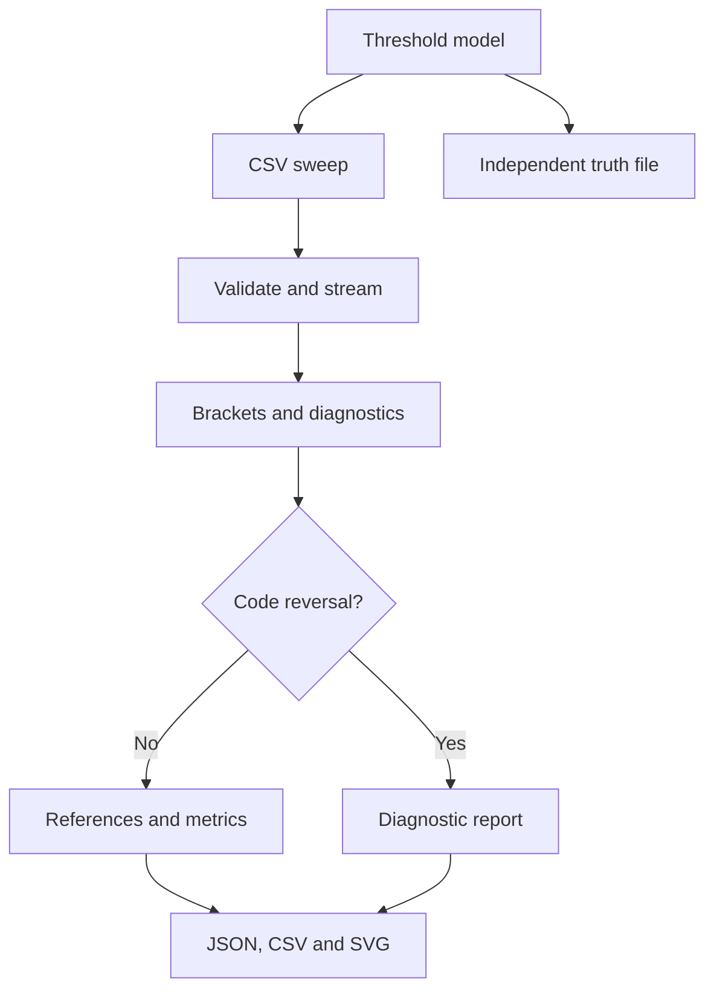

# Architecture and file contracts



The analyzer never opens truth.json. Demo compares analyzed results to truth only
in a separate comparison step. Module types may evolve internally, but public
serialization and numerical conventions must remain stable.

| File | Public responsibility | Inputs -> outputs |
| --- | --- | --- |
| src/lib.rs | Export domain modules and AuditError | Library API |
| src/config.rs | Validate bit depth/range and output caps | AuditConfig -> DerivedConfig |
| src/model.rs | Domain data, statuses, nullable estimates | Structs/enums only |
| src/input.rs | CSV header/record validation and streaming | Read -> Iterator<Result<Sample>> |
| src/transitions.rs | Stateful observation builder | Samples -> Observation |
| src/analysis.rs | Widths, references, bounds, summary/calibration | Observation + selection -> AuditReport |
| src/synthetic.rs | Threshold models and deterministic sweep iterator | SynthConfig -> ThresholdModel + Samples |
| src/report.rs | Finite-value validation and stable reports | AuditReport + Write / directory |
| src/svg.rs | Pure SVG rendering | Report + PlotData -> String |
| src/cli.rs | clap definitions, orchestration, exit mapping | args -> exit status |
| src/main.rs | Thin error-printing entry point | cli::run() |

Recommended pure interfaces (names can be refactored without changing contracts):

```rust
pub fn analyze<R: std::io::Read>(reader: R, config: &AuditConfig,
    references: ReferenceSelection) -> Result<AuditReport, AuditError>;
pub fn extract<I>(samples: I, config: &DerivedConfig) -> Result<Observation, AuditError>
where I: IntoIterator<Item = Result<Sample, AuditError>>;
pub fn fit_reference(kind: ReferenceKind, obs: &Observation,
    config: &DerivedConfig) -> ReferenceResult;
pub fn make_thresholds(config: &SynthConfig) -> Result<ThresholdModel, AuditError>;
pub fn render_transfer(report: &AuditReport) -> Result<String, AuditError>;
pub fn write_report(report: &AuditReport, out: &std::path::Path)
    -> Result<(), AuditError>;
```

## Domain model

- Sample: record:u64, input_v:f64, code:usize.
- Bracket: lower_v, upper_v, lower_record, upper_record; closed conservative bounds.
- Transition: k, status, bracket:Option, estimate_v:Option, half_bracket_v:Option.
- CodeObservation: code, samples:u64, observation_status.
- CodeWidth: code, width_status, point_v:Option, lower_v:Option, upper_v:Option,
  nominal_dnl_lsb:Option, nominal_dnl_lower_lsb:Option, nominal_dnl_upper_lsb:Option.
- ReferenceLine: a_v,b_v_per_code,anchor_k,anchor_v; immutable once fitted.
- ReferenceResult: name, availability, reason, line:Option, coverage,
  transition_metrics, code_metrics, dnl_summary:Option, inl_summary:Option.
- TransitionMetric: k,inl_lsb:Option,cumulative_inl_lsb:Option,
  cumulative_run_id:Option<u32>,cumulative_run_start:bool.
- CodeMetric: code,dnl_lsb:Option. Bounds are nominal-only on the top-level data.
- Calibration: availability, reason, offset fields and gain-span fields.
- DiagnosticEvent: previous/current record, voltage, code; kind.
- PlotData: bounded raw points; not part of public summary JSON if unnecessary.
- AuditReport: schema/config/status, observations, code widths, references,
  calibration, diagnostics, quality, limitations, plot data skipped in serde.

Avoid multiple mutable authoritative copies. Raw transition evidence is immutable after
finalization; reference metrics point to k/code keys rather than changing raw estimates.
All serde enum spellings are snake_case; CLI spelling best-fit maps to JSON best_fit.
Represent unavailability explicitly; never a zero-filled default vector of measurements.

## Implemented module boundaries

The modules above are implemented and exercised through unit, integration, CLI, and
artifact tests. `main.rs` is intentionally thin; command parsing and exit mapping live
in `cli.rs`, while numerical and serialization code remain independent of stdout.
See `VALIDATION.md` for the current toolchain and completed verification commands.
